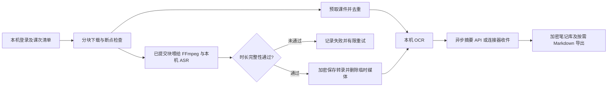

# 4048《当代中国经济与社会专题研究》本机运行方案

2026-10-09，Asia/Singapore。教师：林超超；历史学系；2023-2024-2。

采用本机获取课程资料、本机 SenseVoice 转录、本机 RapidOCR，再将文字提交给指定摘要 API 的方式。GitHub Actions 不参与这次运行。方案与已有控制台并行，运行文件位于项目 `work/local-course-4048/`，不会自动上传、发邮件或修改订阅。

## 当前实测状态

| 项目 | 结果 |
| --- | --- |
| 本机 | Apple M3，16 GiB 内存 |
| 课程身份 | 已从本机加密资料库的课程目录核实 ID、标题、教师、学期和院系 |
| 在线清单 | 共 10 次，8 次有回放；2024-04-17 与 2024-05-01 无回放 |
| 独立环境 | `.venv-course`，Python 3.12.13；已安装并锁定本次依赖版本 |
| ASR | 现有 SenseVoice int8、Silero VAD 均成功初始化，4 线程 |
| OCR | RapidOCR 引擎成功初始化 |
| FFmpeg | imageio-ffmpeg 提供的 FFmpeg 7.1，可按需使用，不改系统 PATH |
| 自动化验证 | 新脚本、网络适配器、续传、流水调度、真实 FFmpeg 重叠解码、默认摘要配置、摘要收件、转录文字与笔记标题测试合计 72 项通过 |
| 登录链路 | 浏览器兼容 HTTPS 传输已完成 WebVPN 与 iCourse 登录；只在内存保留会话 |
| 浏览器 | 本机 Chrome 能加载 WebVPN 登录页；用户确认浏览器可以打开并登录 |
| 实际运行 | 22:30 启动 PID 46294，从第二讲检查点续跑；当前前四讲转录、OCR 和笔记均已验收，第五讲边下载边转录，其余等待处理 |
| 真实续传 | 实测停止后从已提交的 40 MiB 继续下载至 48 MiB，随后继续推进；没有重新下载前 40 MiB |
| 截断拦截 | 原直流式取流在约 6–7 分钟处提前结束，完整性检查拒绝保存；已改为分块续传后转录 |
| 后台检查 | 用户已删除“4048 本机课程处理”定时任务；本机准备进程继续运行，摘要收件属于运行进程内部步骤 |
| 首节验收 | 6432.75 秒录播，实际解码 6432.725 秒；32088 字转录、226 个时间段；课件 22 页有效 OCR，1 页去重，0 页失败 |
| 首节重叠实测 | 22:14:00 开始尾读 ASR，下载尚未结束；22:18:46 完成 107 分钟音频转录，随后 OCR 验收；其间第二节已开始下载 |
| 请求开销实测 | 切换后首节剩余约 101 MiB 用了 3 次媒体请求、1 次签名；包含一次响应中断后的块级续传 |
| 默认摘要 | 本机配置首位为 Mimo / mimo-v2.6-pro，地址 https://token-plan-cn.xiaomimimo.com/v1。用户已授权永久保存 Key，已在 macOS 钥匙串保存并验证自动读取；被 Mimo 拒绝的本课程课次已授权使用 DeepSeek |
| 网络诊断 | 普通 requests 的登录会话曾超时；使用 curl-cffi 浏览器兼容传输后登录成功。尚未将单次成功认定为长期稳定性证明 |

**当前已完成 4/8 次有回放课次的笔记，完整课程仍在处理。** 第一、第二、第四讲使用 `DeepSeek/deepseek-v4-pro`，第三讲使用 `Mimo/mimo-v2.6-pro`。实际完成数以 `status` 和最终 `validation.json` 为准。

## 流程与验收



1. **登录与会话。** 复用已有 Keychain 凭据，在运行进程内独立登录；WebVPN 使用浏览器兼容 HTTPS 传输。账号验证失败不重试；已成功登录后出现冷会话或 CAS 临时跳转缺失，最多重新登录一次。未读取或存储浏览器 Cookie。
2. **取得清单后先跑一节。** 按录播 ID 去重，同一天不同录播不合并。核对标题和教师，只处理平台标记有回放的课次。默认 `--limit 1`，不会顺带处理其他课程。
3. **完整性门槛。** 每个网络请求最多获取 64 MiB，每 8 MiB 独立 fsync 并原子提交检查点；签名只在内存复用，最长 240 秒，授权失败立即刷新。验证 HTTP 206、Content-Range、已提交块长度、媒体总大小、源路径指纹及服务端版本。响应的最后一块在正常结束后提交；中断的尾块在续跑时丢弃。下载、解码与 ASR 重叠，提交转录前仍要求全文件获取完成，并与实际解码时长比较，允许偏差为 `max(3 秒, 录播时长 × 0.5%)`。未知时长、音频截断或空转录不写入成功检查点。此项验证传输完整性；人名、术语和句子识别准确性仍需抽查。
4. **OCR 与转录分阶段保存。** 复用 Actions 的 `LectureRunner`、`Scheduler`、`PPTPipeline`、`Transcriber.transcribe_tail`；替换网络音频下载器为可续传本机适配器。首节实测为 fast-start MP4，只有完整提交的块才喂给 FFmpeg；元数据在文件尾部的 MP4 自动等待完整可寻址文件。课件下载、去重提前进行，OCR 延后以保留 ASR 的 CPU；下一节课件 OCR 与当前摘要等待重叠。转录及 OCR 分别加密保存；截图清单失败不会视为零页。临时媒体和 PCM 为私有目录中的明文文件，权限 600，转录成功保存后删除；失败或停止时保留已验证媒体块。每次下载检查剩余空间，并额外保留至少 1 GiB。
5. **摘要异步执行。** 只处理已通过转录及 OCR 检查的课次；每讲就绪自动写入 `summary-requests/<ID>.json`。本机终端运行 `scripts/summarize_local_course.command`，按项目保存顺序选第一个已启用服务商和第一个模型，自动读取对应的 macOS 钥匙串 Key；缺少记录时才隐藏输入。从加密检查点重建已验收材料，再调用 API。结果携带课次、课程、源输入 SHA256、完整正文、响应实际模型名及 `finish_reason=stop`，原子写入 `summary-results/<ID>.json`。同一输入已有完整结果时跳过调用。运行中的准备进程自动导入并逐讲导出笔记；已退出时终端摘要入口自动导入导出，不需重启或等待全部转录。`prepare --provider 名称 --model ID` 可直接启用内部摘要线程。Key 不写入项目文件或日志；不从 GitHub Secret 取回，也不复制连接器凭据。摘要失败后保留完整结果与转录/OCR，重新运行终端入口即可续跑。
6. **流水调度与续跑。** 网络下载默认一个槽位，优先当前课；当前媒体完成后立即开始预取下一课，与当前 ASR、OCR 或摘要重叠。每个网络请求最多尝试 3 次、每课最多尝试 3 次，失败保留已提交块。同门课程的进程锁覆盖登录、下载、ASR 与 OCR，重复启动会在登录前拒绝；`status` 可读取运行中的最新检查点及下载字节数。已保存的完整阶段自动跳过；共享数据库的备份、加密与替换由同一个锁保护。

第一节应核对：录播时长与解码时长、开头/中间/结尾文字是否连续、PPT 页数与有效 OCR、摘要中的人名和核心论点、实际模型名，以及一次停止后续跑是否复用检查点。清单中的无回放、失败或需人工检查的课次分别列出，不能把它们计为“整门课完成”。

## 已准备的运行入口

入口：`scripts/run_local_course.command`；默认启动课程 4048 的所有未完成回放。底层脚本为 `scripts/local_course.py`，使用隔离的 `.venv-course`。

```bash
cd /Users/nidao./Documents/kimi/Workspaces/iCourse

# 只登录和读取本门课程的清单，不转录、不调用摘要 API
scripts/run_local_course.command inspect

# 启动 / 续跑全部未完成的回放；防止空闲休眠
scripts/run_local_course.command

# 独立后台启动 / 续跑（本机已存有 Keychain 凭据时使用）
.venv-course/bin/python scripts/start_local_course.py --limit 8

# 查看已完成阶段，允许在处理进程运行时使用
scripts/run_local_course.command status

# 导出已验收原始材料供本机审阅，不调用摘要 API
scripts/run_local_course.command export-materials --sub-id 101945

# 在另一个本机终端启动默认摘要：不打断正在运行的转录/OCR
# 逐讲等待材料验收；自动读取已保存的钥匙串 Key
scripts/summarize_local_course.command

# 永久保存或更新默认服务商 Key：仅在终端隐藏输入
scripts/remember_local_api.command

# 下次从头启动前台完整流水：使用项目默认摘要配置
scripts/run_local_course.command prepare --limit 8 --provider default

# 仅对已完成转录和 OCR 的课次生成摘要；自动读取钥匙串 Key
scripts/run_local_course.command summarize --provider default --limit 10000

# 导出已有摘要到本机 Markdown
scripts/run_local_course.command export
```

`--provider default` 使用本机模型管理中保存的首个已启用服务商；`--model` 默认该服务商的首个模型。指定名称时严格核对配置，不因某个 Key 缺失而换到其他域名。当前默认为 Mimo / `mimo-v2.6-pro`；优先使用当前进程环境中的 Key，随后读取用户保存的 macOS 钥匙串记录，无已保存 Key 时才在终端隐藏输入。GitHub Secret 无法读回本机。需要改为其他已保存服务时可用 `scripts/summarize_local_course.command --provider 名称 --model ID`。输入指纹不符、课程不符或输出非 `stop` 均拒绝导入；实际 API 可用性以完整响应验收。

### 摘要非正常结束的修复（2026-10-09 23:20）

首次 Mimo 调用在返回后触发“摘要未正常完成”；原错误没有记录具体 `finish_reason`，不能据此断定一定是长度截断。终端摘要入口现对官方 Mimo 及当前 Token Plan 域名明确传入 `max_completion_tokens=32768`、`thinking.type=disabled`，将输出预算用于详细笔记；只有返回 `length` 时增加到 65536 重试一次。其他非 `stop` 状态仍拒绝导入，错误记录包含真实结束原因、正文长度和 token 用量，成功收据保存实际模型与用量。参数依据 [Mimo 官方 Chat API](https://mimo.mi.com/docs/en-US/api/chat)及[深度思考说明](https://mimo.mi.com/docs/en-US/quick-start/usage-guide/other/deep-thinking)。

本次修复相关的摘要、流水与课程测试共 40 项通过，包括两个官方域名参数、一次长度重试、连续截断拒绝以及其他域名隔离。实际成功仍需完整 API 响应验收。终端输出另存 `summary.log`，可从 `summary-status.json` 判断等待 Key、生成、等待材料、完成或失败；Key 通过 `/dev/tty` 隐藏输入，不进入日志。旧摘要进程失败退出后，其内存中的 Key 已丢失，需要在新终端入口重新输入；已验收的转录与 OCR 无需重跑。

23:25 的实际响应确认首讲 `finish_reason=content_filter`，并非长度截断。用户随后明确授权把首讲完整转录及课件 OCR 发给已连接的 DeepSeek；首讲已用 `DeepSeek/deepseek-v4-pro` 完整生成、核对输入指纹并导入，共约 8800 字。第二讲也出现 Mimo 内容过滤；拒绝结果不计为完成，保存在 `summary-failures/`，同一服务、模型和输入在重启后不会自动重复调用。连接错误、429 或服务端 5xx 有限重试；单讲非完整响应保留失败记录并继续后续讲次。

用户已要求永久保存 Mimo API Key，并在本机隐藏输入窗口完成保存。`local_web/api_keychain.py` 通过 macOS 原生 Security API 保存到系统钥匙串，不经子进程参数或项目文件；记录绑定服务商与完整 API 地址。`build_summarizer` 自动读取相同配置的 Key，并在地址被环境变量改到其他目的地时拒绝启动。已验证真实系统钥匙串的合成值写入、读回、更新、删除，以及用户 Key 的存在和新摘要进程自动读取；只输出存在状态。更新 Key 可运行 `scripts/remember_local_api.command`。当前相关摘要、流水、课程和钥匙串测试共 46 项通过。

23:35 用户进一步明确授权：本课程后续被 Mimo 拒绝的课次，其已验收完整转录和课件 OCR 可以发送至已连接的 DeepSeek API 生成笔记。此授权仅限课程 4048；调用前从本机加密检查点导出对应课次，实际响应必须为 `stop` 且正文非空，收据携带输入指纹与真实响应模型，再由准备进程导入。不会把 Mimo 拒绝的响应标为成功。

复用到另一门课：复制 `scripts/course-4048.json`，填写课程 ID、名称、教师、学期和院系，然后每个阶段都传入 `--course-config 新配置.json`。脚本核对在线课程名称和教师，并使用独立的 `work/local-course-课程ID/`；避免不同课程混入同一份检查点。

在同类 Mac 上重建环境，使用 Python 3.12 创建 `.venv-course`，再执行 `.venv-course/bin/python -m pip install -r requirements-course.txt`。该文件固定本次安装版本；SenseVoice 和 Silero 权重沿用本项目已有的本机模型。其他操作系统或 Python 版本需重新验收。

指定课次用 `--sub-id <清单中的 ID>`。批量处理用 `--limit 3` 或 `--limit 5`；每次从未完成阶段继续。后台日志为 `run.log`，运行标记为 `active-job.json`。保持电脑供电、开盖及联网；`caffeinate` 防止空闲睡眠，合盖或断电后需恢复并续跑。当前没有 Codex 定时任务。终端摘要入口是持续运行的本机进程，需保留终端窗口；输入 Key 后会等待后续材料并逐讲导出，停止后可重开续跑。

## 本地产物

| 文件 | 内容 |
| --- | --- |
| `manifest.json` | 成功读取的课程和课次清单，无密码 |
| `icourse.db.enc` | 本门课独立加密数据库，含转录、时间段、OCR、摘要与阶段证据 |
| `last-run.json` | 最近一批的尝试数及脱敏失败信息 |
| `media/<sub_id>.mp4.part` / `.json` | 临时录播与已提交字节进度；不含签名 URL、密码或 Cookie，转录成功后删除 |
| `media/<sub_id>.raw` | FFmpeg 输出的临时 PCM 音频，转录结束后删除；中断时不会作为完整转录使用 |
| `summary-requests/<ID>.json` / `summary-results/<ID>.json` | 通过材料验收的摘要请求 / 连接器完整结果；均为本机私有文件 |
| `materials/<ID>/transcript.md` / `ocr.md` / `segments.json` / `validation.json` | 已验收机器转录、课件 OCR、时间段和证据，供本机审阅；尚未作术语校对 |
| `run.log` / `active-job.json` | 当前后台日志 / 活跃任务标记 |
| `summary.log` / `summary-status.json` | 终端摘要日志及阶段状态；不保存 Key |
| 项目根目录 `requirements-course.txt` | 本次安装环境的完整固定版本，供环境重建 |
| `notes/<sub_id>.md` | 显式执行 export 时导出的明文摘要 |
| `notes/index.md` / `notes/course.md` | 课次阅读索引 / 已完成笔记合订本 |
| `validation.json` | 各课次的音频时长、文字数量、OCR 与摘要模型验收记录 |

文件夹权限为 700，输出文件为 600；整个运行目录及虚拟环境已加入 Git 忽略。SQLite 只在私有临时目录打开，每个成功阶段使用 SQLite backup 生成一致快照，再原子替换加密文件。这个数据库暂未自动合并进现有 Web 控制台；导出的 Markdown 可直接阅读，启动入口独立。

## 工程边界

脚本已通过离线测试、在线登录、短音频读取、真实分块下载与停止后续传，完整课程运行仍在验收。复用了现有转录与 OCR 处理代码，包括内部接口；后续升级依赖或重构接口需重新验证。自动检查覆盖传输完整性，不能替代术语与人物姓名的人工校对。

新增会话 Cookie 缓存曾被自动审批拒绝，已取消该方案；运行进程结束后重新登录，不保留会话缓存。

早期首讲材料发送至 DeepSeek 的连接器调用曾因授权不足被自动审批拒绝；当时转为用户选定的默认 Mimo 终端入口。Mimo 实际返回内容过滤后，用户明确授权首讲、随后授权本课程其他被拒绝课次使用已连接的 DeepSeek；在此授权下已成功完成首讲与第二讲，并记录实际模型及完整响应证据。

分块响应验证依据 [RFC 9110 的 Range / Content-Range 语义](https://www.rfc-editor.org/rfc/rfc9110.html#section-14)。SenseVoice 模型沿用现有权重，参见 [sherpa-onnx 官方模型说明](https://k2-fsa.github.io/sherpa/onnx/sense-voice/pretrained.html)。

浏览器兼容 HTTPS 使用 [curl-cffi 官方说明](https://github.com/lexiforest/curl_cffi/blob/main/README.md)所支持的 TLS / HTTP 浏览器特征；保留 requests 的重定向和内存 CookieJar，并测试了跨域 Cookie 隔离。
